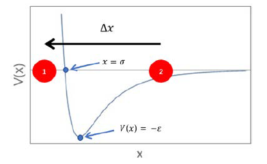
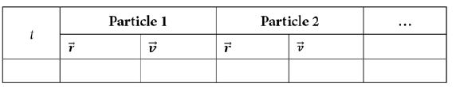
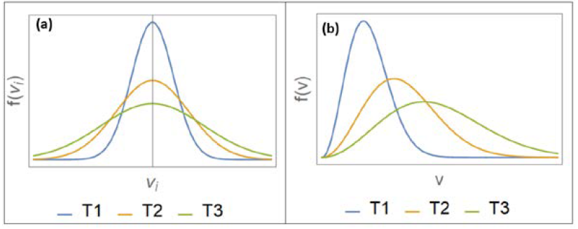
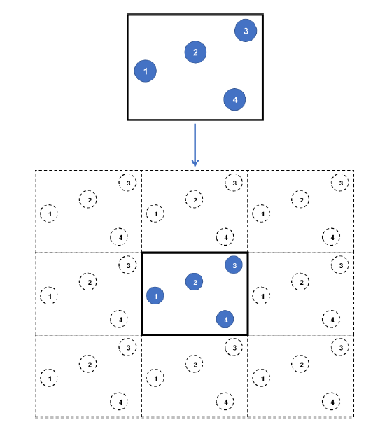
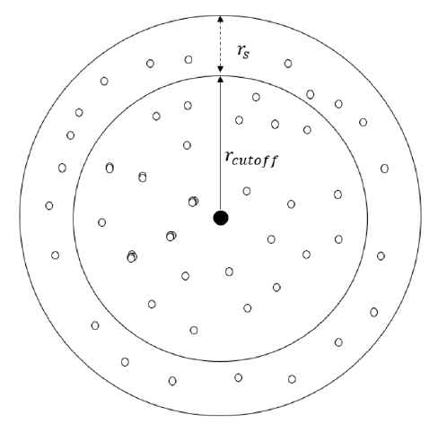
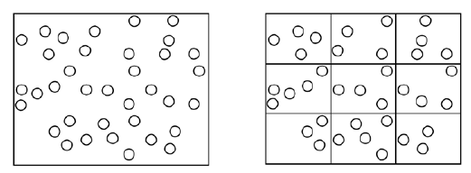
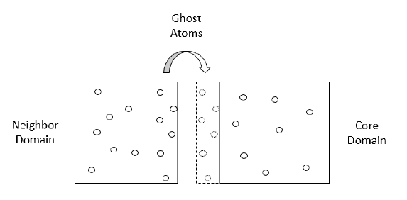

# 1 MD Theory and Simulation Practices

This chapter introduces the theory behind molecular dynamics (MD) and some common  simulation practices. Starting from Newton's laws, we outline the physics behind the  dynamics of point particles and rigid bodies, discuss iterative updating and the relevance  of temperature, and end by listing computational practices.

In this chapter, we will cover the follow topics:
•  Introducing MD theory

•  Understanding the dynamics of point particles

•  Performing iterative updates using the Velocity Verlet algorithm

•  Understanding rotational motion

•  Examining temperature and velocity distribution of particles

•  Implementing MD simulation practices including cutoff, periodic boundaries, and neighbor lists

By the end of this chapter, you will have grasped an understanding of the theoretical fundamentals implemented in MD software.

## Technical requirements
You can find the full source code used in this book here: https://github.com/PacktPublishing/Extending-and-Modifying-LAMMPS-Writing-Your-Own-Source-Code

## Introducing MD theory
MD is based on simulating individual particle trajectories over a desired time period to  analyze the time evolution of an entire system of particles in a solid, liquid, or gaseous  state. Each particle (usually an atom) is allowed to traverse in space as determined  by Newton's laws of classical dynamics, where the atomic positions, velocities, and  accelerations at one point in time are used to calculate the corresponding kinematics  quantities at a different point in time. This process is repeated over a sufficiently long-time  interval for every atom in a system, and the final configuration of the atoms indicates the  time evolution of the system over the said time interval.

Typical MD simulations are limited to the study of atomistic systems consisting of  atoms in the range of $10^2$ to $10^6$, occupying a simulation box with a length in the  order of nanometers, over a regular timescale of nanoseconds. MD simulations of  such microscopic systems are relevant when the systems are able to represent the time  evolution of corresponding macroscopic systems.

The theory behind MD is described briefly in the following sections. For a more detailed  understanding, you are advised to refer to the dedicated literature on MD theory  (Computer Simulation of Liquids by Michael P. Allen and Dominic J. Tildesley, and  Understanding Molecular Simulation by Daan Frenkel and Berend Smit).

## Understanding the dynamics of point particles
The trajectory $\overrightarrow{r}(t) = (x(t),y(t),z(t))$ of a point particle over time $t$ is calculated from its mass $m$ and net force $\overrightarrow{F_{net}}$ using Newton's equation, as illustrated here:
$$\overrightarrow{F_{net}}=m\overrightarrow{\ddot{r}}(t)$$
$\overrightarrow{F_{net}}$ is determined from the sum of all forces acting on the particle. In a system of interacting particles, the force $\overrightarrow{F}$ acting between one pair of particles can be determined from the gradient of the potential energy function $V(\Delta{x},\Delta{y},\Delta{z})$. Here, $(\Delta{x},\Delta{y},\Delta{z})$ is the displacement vector that points to the particle for which we are calculating $\overrightarrow{F}$ (using the following equation) and originates from the other particle in the pair (shown in Figure 1.1):
$$\overrightarrow{F} = -\nabla{V}(\Delta{x},\Delta{y},\Delta{z})$$

This gives us the three components of $\overrightarrow{F}=(F_x,F_y,F_z)$. The $(x)$ force component is given as follows:
$$F_x=-\frac{dV}{dr}\cdot\frac{\Delta{x}}{r}$$
The $(y)$ force component is calculated by the following formula:
$$F_x=-\frac{dV}{dr}\cdot\frac{\Delta{y}}{r}$$
The $(z)$ force component is given by the following formula:
$$F_x=-\frac{dV}{dr}\cdot\frac{\Delta{z}}{r}$$
Here, $r=|(\Delta{x},\Delta{y},\Delta{z})|$ is the distance between the pair of particles. By Newton's third law, it follows that the force components acting on the other particle in the pair have the same  magnitudes, with the opposite sign.

The following diagram illustrates this concept, using two particles interacting via a 12-6 Lennard-Jones potential of the form $V(x)=4\epsilon[(\frac{\sigma}{x})^{12}-(\frac{\sigma}{x})^6]$, where $\epsilon$ represents the well depth and $\sigma$ represents the position at which the potential is zero:

Figure 1.1 - Two particles in 1D interact via a Lennard-Jones potential $V(x)=4\epsilon[(\frac{\sigma}{x})^{12}-(\frac{\sigma}{x})^6]$

In this diagram, if we want to calculate the force from particle 2 (located at $x=|\Delta{x}|$) acting on particle 1 (located at $x=0$), then we use $F_{x1}=-\frac{dV}{dx}\frac{(-|\Delta{x}|)}{|\Delta{x}|}$. Subsequently, the reaction force acting on particle 2 is given by $F_{x2}=-\frac{dV}{dx}\frac{(-|\Delta{x}|)}{|\Delta{x}|}$.

Since potential energy functions are commonly expressed as functions of r, the expressions we saw earlier make it more convenient to calculate the force components. The sum of forces acting on a single particle by its interaction with all particles in the system gives the net force, as illustrated here:
$$\overrightarrow{F_{net}}=\sum_{all pairs}{\overrightarrow{F}}=-\sum_{all pairs}{\nabla V}$$
Altogether, we obtain three equations to solve for $𝑥(𝑡)$, $y(𝑡)$, and $z(𝑡)$. The $x(t)$ equation is given as follows:
$$\ddot{x}=-\frac{1}{m}\sum_{all pairs}{(\frac{dV}{dr}\cdot\frac{x}{r})}$$
The $y(t)$ equation is given by the following formula:
$$\ddot{y}=-\frac{1}{m}\sum_{all pairs}{(\frac{dV}{dr}\cdot\frac{y}{r})}$$
The $z(t)$ equation is given by the following formula:
$$\ddot{z}=-\frac{1}{m}\sum_{all pairs}{(\frac{dV}{dr}\cdot\frac{z}{r})}$$

These values are used to generate the complete trajectory of the particle over a desired time interval. This process is repeated for all particles in the system to yield the complete system time evolution in the same time interval.

## Performing iterative updates using the Velocity Verlet algorithm
As particles move in a system over time, the separation  changes accordingly, resulting in a change of the derivatives described in the previous  section—that is, the force becomes time-dependent. Therefore, the trajectory is updated  over a small increment of time called the timestep $(\Delta t)$ trajectory over a large number of timesteps, a complete trajectory can be obtained.

The purpose of keeping the timestep small is to ensure that the particles do not undergo drastic changes in position and therefore conserve energy in the system. For atomic masses, especially in the presence of forces from molecular bonds, angles, and dihedrals, a timestep of approximately 1 femtosecond is typically employed.

An advantage of using a small timestep is that the net force $F_{net}$ can be approximated to remain constant in the duration of the timestep. Therefore, the  equations of motion that iteratively update the trajectory at timestep increments become  the following:
$$x(t+\Delta t)=x(t)+v_x(t)\Delta t + \frac{1}{2}\frac{F_{net,x^(t)}}{m}\Delta t^2$$
$$y(t+\Delta t)=y(t)+v_y(t)\Delta t + \frac{1}{2}\frac{F_{net,y^(t)}}{m}\Delta t^2$$
$$z(t+\Delta t)=z(t)+v_z(t)\Delta t + \frac{1}{2}\frac{F_{net,z^(t)}}{m}\Delta t^2$$

Here, $(v_x(t),v_y(t),v_z(t))$ represents the velocity vector of the particle, and its components are iteratively updated by the following:
$$v_x(t+\Delta t)=v_x(t) + \frac{1}{2}[\frac{F_{net,x^(t)}}{m}+\frac{F_{net,x^(t+\Delta t)}}{m}]\Delta t$$
$$v_y(t+\Delta t)=v_y(t) + \frac{1}{2}[\frac{F_{net,y^(t)}}{m}+\frac{F_{net,y^(t+\Delta t)}}{m}]\Delta t$$
$$v_z(t+\Delta t)=v_z(t) + \frac{1}{2}[\frac{F_{net,z^(t)}}{m}+\frac{F_{net,z^(t+\Delta t)}}{m}]\Delta t$$

Here, the terms within the $[ ]$ represent the average acceleration in each dimension, calculated using the accelerations at time t and the following iteration, $(𝑡 + \Delta 𝑡)$ . This is known as the **Velocity Verlet algorithm**, which considerably reduces errors over a long simulation period as compared to algorithms that use the acceleration at a single point in time (for example, the **Euler algorithm**). Furthermore, the Velocity Verlet algorithm is able to conserve energy and momentum within rounding errors with a sufficiently small timestep, unlike the Euler algorithm, which can lead to an indefinite increase in energy over time.

In effect, the position and velocity of each particle are tabulated at each iteration, as illustrated in the following table:

Table 1.1 - Table showing sequence of iterative update of position and velocity vectors of each particle

This table shows the sequence of iterative update of point particles that undergo a linear  motion without any rotational component. In the case of a non-point object such as a  rigid body, both linear and rotational motion must be incorporated for a proper treatment  of its dynamics. Similar to linear motion, rotational motion of rigid bodies can be  iteratively updated using a similar algorithm, as discussed next.

## Understanding rotational motion
Rigid bodies are often used to represent molecules with inactive vibrational degrees of  freedom. In a rigid body, the locations of all constituent atoms are frozen with respect   to the rigid-body coordinates. The intramolecular forces from bonds, angles, dihedrals,   and impropers are assumed not to create any distortion of the rigid body. Therefore, for   the purposes of MD, all intramolecular forces in a rigid body can be disregarded. Any  force exerted on any constituent atom in a rigid body acts on the entire rigid body. In  addition to changing its linear velocity, this force can create a torque on the rigid body   and change its angular momentum and angular velocity. The total force on a rigid body $\overrightarrow{F_{tot}}$ composed of N particles is calculated using the following formula:
$$\overrightarrow{F_{tot}}=\sum_{i=1}^{N}{(\overrightarrow{F_i})}$$
Using the displacement vector $\overrightarrow{r_i}=(x_i,y_i,z_i)$ of particle $i$ measured from the center of
mass of the rigid body as the origin, the torque $\overrightarrow{\tau}$ of the rigid body is calculated by the
following formula:
$$\overrightarrow{\tau}=\sum_{i=1}^{N}{(\overrightarrow{r_i}\times{\overrightarrow{F_i}})}=\sum_{i=1}^{N}{(y_iF_{zi}-z_iF_{yi},z_iF_{xi}-x_iF_{zi},x_iF_{yi}-y_iF_{xi})}$$

The angular momentum $\overrightarrow{L}$ of the rigid body is obtained from the time-integration of $\tau$ using the Velocity Verlet algorithm, as follows:
$$\overrightarrow{L}(t+\Delta t)=\overrightarrow{L}(t)+\frac{1}{2}[\overrightarrow{\tau}(t)+\overrightarrow{\tau}(t+\Delta t)]\Delta t$$

The angular velocity $\overrightarrow{\omega}$  of the rigid body is obtained by a two-step procedure from $\overrightarrow{L}$ using an intermediate step at a half-timestep $(t+\frac{1}{2}\Delta t)$, and a second step at a full-timestep $(t+\Delta t)$, which will be described in more detail when analyzing the dynamics of rigid bodies in Chapter 7, Understanding Fixes. The procedure is illustrated here:
$$I\overrightarrow{\omega}(t+\frac{1}{2}\Delta t)=\overrightarrow{L}(t+\frac{1}{2}\Delta t)$$
$$I\overrightarrow{\omega}(t+\Delta t)=\overrightarrow{L}(t+\Delta t)$$

Here, *$I$* is the moment of inertia tensor of the rigid body.

For a system of point particles or rigid bodies, the average kinetic energy and the average  speed or angular speed are determined by the system temperature. Therefore, controlling  the temperature adequately is often essential when simulating a molecular system.  The next section discusses the features of a molecular simulation determined by the  temperature.

## Examining temperature and velocity distribution of particles
A system at thermal equilibrium at a constant temperature T is characterized by its  **Maxwell-Boltzmann velocity distribution**. According to this distribution, the probability  distribution $f(v_i)$  of velocities in a single direction $i$ (which can be $x$,$y$,$z$) of a system of   particles of mass m each is given by the **Gaussian function**, illustrated here in Figure 1.2:

Figure 1.2 – The Maxwell-Boltzmann velocity distributions (left) and speed distributions (right)

The preceding graph is plotted for the same system at three different temperatures $T3>T2>T1$.

The corresponding functional form that depends on the mass and temperature is shown here:
$$f(v_i)=\sqrt{\frac{m}{2\pi k_BT}exp(-\frac{mv_i^2}{2k_BT})}$$

Here, $k_B$ is the Boltzmann constant. This distribution has a mean of $\mu=0$ and a standard deviation of $\sigma=\sqrt{\frac{k_BT}{m}}$. The shape of the Gaussian curve is determined by the ratio of $\frac{m}{T}$. The velocity distribution of the velocity vector $(v_x,v_y,v_z)$ is given by the following formula:
$$f(v_x,v_y,v_z)=f(v_x)f(v_y)f(v_z)=(\frac{m}{2\pi k_BT})^{\frac{3}{2}}exp[-\frac{m(v_x^2+v_y^2+v_z^2)}{2k_BT}]$$

In spherical coordinates, this distribution can be written in terms of the speed as follows:
$$f(v)=\sqrt{\frac{2}{\pi}}(\frac{m}{k_BT})^{\frac{3}{2}}v^2\exp[-\frac{mv^2}{2k_BT}]$$

This is the Maxwell-Boltzmann speed distribution, also known as a **Rayleigh distribution**.  The shape of the speed distribution changes with temperature, as shown in Figure 1.2, and  the peak speed increases with temperature. The velocity distributions are wider at higher  temperatures, and the speed distributions show larger peak speeds at higher temperatures.  An algorithm that controls temperature in a molecular simulation must account for the  preceding features regarding particle velocities.

So far, concepts that dictate the operation of an MD simulation have been discussed.  These concepts are implemented in a computational environment through codes that will  be discussed in later chapters. In the next section, we will discuss related computational  concepts that are commonly encountered in MD simulations and that are prevalently   used to enhance simulation performance. 

## Implementing MD simulation practices
In order to implement MD simulations that are computationally efficient and model  realistic atomic systems, a number of standard simulation practices are employed. A  user is likely to find these practices employed in typical **Large-scale Atomic/Molecular  Massively Parallel Simulator (LAMMPS)** scripts and it is therefore helpful to be familiar  with these concepts before delving into the LAMMPS source code. In this section, we will  briefly discuss some of these practices (details are available in the MD textbooks referred  to in the *Introducing MD theory* section).

### Pair-potential cutoff
If it is desired that a potential reaches exactly zero at the cutoff, an offset ($V_{offset}$) can be employed by calculating the potential $V(r)$ at the cutoff $r=r_{cut}$, that is $V_{offset}=V(r_{cut})$ . This offset can then be subtracted from the original potential to guarantee a zero value at the cutoff, that is $V(r)\rightarrow V(r)-V_{offset}$. Altogether, the potential with the offset changes the value of the system potential, but does not alter the forces because $V_{offset}$ is a constant term that produces zero force contribution upon differentiating.

Most pair-potential functions are defined to asymptotically approach zero potential—  for example, the Lennard-Jones function approaches zero as the *inverse-sixth* power of  separation. For particles located far from each other, it implies that there exists some small  but non-zero potential between them, which may be negligible in a simulation context but  still adds numerical computation overhead.

Therefore, a common practice is to employ a cutoff distance for pair potentials, beyond  which the interaction is assumed to be zero. The cutoff is chosen at a separation where  the potential value is sufficiently small so as not to create significant errors by discounting  interaction with neighbors located beyond the cutoff. During a simulation run, only  the neighbors located within the cutoff radius of a particle are considered for force or  potential calculations, thereby reducing computation time.

### Periodic boundary conditions
Simulated systems often consist of a small cell that is representative of a larger system— for example, nanocrystal representation of a metal lattice. In such systems, it can often be  assumed that the entire system is made up of many replications of the simulation box. In  1912, Born and von Karman came up with the implementation of **periodic boundary conditions** that can simulate a continuous replicated system starting from a simulation box. Each wall (that is, boundary) of the simulation box is assumed to be adjacent to an  identical simulation box containing identical atoms at identical positions. In effect, each  wall of the box leads to a replica of the simulation box, containing images of the same  atoms as in the simulation box. At every iteration, as the atom positions in the simulation  box are updated, the image atoms in the replicas are accordingly updated. The following  diagram shows this simulation box:

Figure 1.3 – A 2D simulation box without (top) and with (bottom) periodic boundaries

In this diagram, we see the following:

- Top: A snapshot of a 2D simulation box consisting of four particles (indexed from **1** to **4**) without periodic boundaries.

- Bottom: The same simulation box with periodic boundaries in all directions produces 8 replicas (26 replicas in 3D) containing image atoms ($dashed circles$). At 
every iteration, all replicas are identically updated by replicating the particles in the central simulation box.

This way, enclosing wall boundaries are eliminated, and any atom that exits the simulation  box by passing through a wall will automatically re-enter through the opposite wall, thus  conserving the number of atoms and modeling continuous motion of atoms. Furthermore,  the atoms in the simulation box are permitted to interact with the image atoms located  in the replicas, ensuring that atoms located near to the walls are not considered as fringe  atoms with few neighbors only because of their remoteness from the box center. 

In *Figure 1.3*, in the absence of periodic boundaries, particle 3 at the top-right corner is  observed to be located far from particles **1** and **4**, and would undergo reduced or zero  interactions with these particles. By contrast, when periodic boundaries are implemented,  particle 3 is located considerably closer to images of particles **1** and **4**.

Subsequently, particle 3 is able to interact with other particles located in all directions  around itself as if it were contained in a continuous, unbounded simulation box. At the same  time, consistency of interaction requires that particle 3 interacts with either an image or with  the original particle in the simulation box, but not both together, and it is accomplished by  setting the side lengths of the simulation box to be at least double the pair-potential cutoff  distance between atoms. This requirement is known as the **minimum image convention**,  which guarantees that pair-potential interactions are not double-counted.

*Long-range electrostatic potentials* decay considerably slower than many other interactions  (as inverse of the separation) and would therefore require disproportionately long cutoffs  and correspondingly large simulation boxes to model with a traditional pair potential. To  circumvent this problem, electrostatic interactions with image atoms are summed up by  an Ewald summation (or a related particle-mesh method) that divides the calculation to a *real-space* component and a *reciprocal-space component*. This way, a cutoff is not required, but periodic boundaries are necessary to ensure sum convergence.

When an atom exits a simulation box and its image enters from the opposite side of the  box, the atom coordinates can extend beyond the simulation box coordinates. This is  accounted for using the concept of wrapped and unwrapped coordinates, where unwrapped  coordinates represent the unadjusted atom coordinates and wrapped coordinates  represent the coordinates adjusted by resetting to the coordinates of the re-entry wall.

In LAMMPS, trajectory output files may include an **image flag** to keep track of wrapped  and unwrapped coordinates. When an atom exits the simulation box along the positive  direction in any dimension, the image flag corresponding to this axis would increment   by one. Accordingly, the image flag decrements by one if the atom exits along the negative  direction. Thus, the image flag of an atom multiplied by the corresponding simulation   box side length can be used to convert from wrapped to unwrapped coordinates.

### Neighbor lists
An atom only interacts with its neighbors located within a cutoff radius, and these neighbors are identified by calculating their distances from the atom in consideration. For a system of N atoms, this could lead to calculating the distance between each of the $\frac{1}{2}(N^2-N)$ pairs of atoms. To reduce the computation overhead, for every atom a subset of neighbors is selected into a **neighbor list** (suggested by Verlet in 1967), and only these short-listed neighbors are used to calculate the interactions with the atom.

At the beginning of a simulation, a neighbor list is built for every interacting atom in  the system by tagging all its neighboring atoms that lie within its cutoff or within a short  buffer width, known as the **skin width** (shown in *Figure 1.4*). If the atoms are not traveling  at extreme speeds, only the atoms located within the cutoff or the skin (that is, the  neighbor-list members) at a certain iteration can be expected to lie inside the cutoff radius  in the next iteration, and it can be expected that no atom previously located outside the  skin will be able to cross inside the cutoff radius in the space of one iteration.

This way, the neighbor list excludes atoms that are located sufficiently far by reusing  information from the preceding iteration, and this therefore reduces computation time   in calculating neighbor distances. The process is illustrated in the following diagram:

Figure 1.4 – Illustration of the radial $r_{cutoff}$ distance and the skin width $r_s$ of a central atom (black dot)

At any timestep, the atoms that are located inside $r_s$ are included in the neighbor list of the central atom, whereas only the atoms located inside $r_{cutoff}$ interact with the central atom. At the next iteration, only the atoms tagged in the neighbor list are considered when identifying atoms that can interact with the central atom, and the neighbor list may be rebuilt depending on the displacements of the atoms.

Generally, the neighbor lists do not have to be rebuilt at every iteration, and the interval  between rebuilding can be defined by the user. Also, a common practice is to rebuild only  when an atom has traveled more than half the skin width since the previous neighbor-list  build. It also implies that a larger skin width requires less frequent neighbor-list builds, at  the cost of including a greater number of neighbors per list at every iteration.

The skin width can be specified independently of the cutoff distance and is generally  chosen according to timestep and expected particle velocities. At the lower limit, the skin  width should be double the maximum displacement expected of a particle in an iteration.  In LAMMPS, if an atom is able to cross the skin width in one iteration, the associated  neighbor lists experience a **dangerous build** whereby the loss of the atom can lead to  errors in force calculations and violation of energy conservation. If a dangerous build is  detected, the neighbor list needs to be rebuilt to rectify this.

When a neighbor list is used to calculate the interaction force between a pair of atoms, the  two atoms in the pair can be assigned equal and opposite forces by Newton's third law. This  equivalency can be enabled using a *full-neighbor* list, whereas it can be disabled by using a  half-neighbor list. While a full-neighbor list reduces computation cost, half-neighbor lists  may be preferred in simulations where equal and opposite forces are not applicable.

### Processer communication
Modern parallel computers have two main forms: **shared-memory** machines, where  multiple processors (often called cores) access the same memory; and **distributed- memory** machines, where a processor (often called a **node**) cannot access the memory  designated to another processor. Modern high-performance computing facilities are  all based on a hybrid architecture. A node consists of multiple cores, and many nodes  combine to form a supercomputer. This architecture also leads to an issue of distributing  the workload and allocating tasks between nodes and cores.

In the context of MD, one strategy that addresses the task allocation problem is **spatial  decomposition**, which divides the simulation box into equal sections and assigns atoms  located in each section to a different core, as shown here:

Figure 1.5 – (Left) A single processing core calculating the trajectory of every atom   in the simulation box. (Right) The simulation box is divided into domains,   and the atoms in each domain are assigned to a different core

The domains in the preceding diagram are spatially decomposed by volume. Copies of  atoms, known as *ghost* atoms, are exchanged between processors to account for interactions  between atoms located on different cores. Each core calculates the interactions of atoms  assigned to it in parallel and thereby increases the overall simulation speed.

To account for interactions between atoms located on different cores, each core builds its  domain with a shell that accommodates particles located at the edges of a domain, and  exchanges copies of particles (known as ghost atoms) with other cores, as illustrated in   the following diagram:

Figure 1.6 – A core domain showing its shell (dashed box) and ghost atoms shared with a neighboring domain

There are two stages of communication between cores involved, detailed here:
- In the first stage, the shell exchanges the ghost-atom coordinates with neighboring  cores to register the particles that can interact with the particles contained in   the domain. The ghost atoms in these shells are essentially images of atoms in   other domains.
- In the second stage, the updated atom positions at the following iteration are used   to determine whether any atom has moved to a different domain, and if so, the atom  coordinates and kinematics information are communicated to the appropriate cores.  After this step, the particles in the shell are deleted from the memory.

This parallel mechanism demonstrates that communication time between cores multiplies as the number of cores increases. Due to memory and bandwidth limits, parallelization cannot achieve the ideal optimization of *N/P*, where *N* is the number of atoms and *P* is the number of processors, and leads to a sub-linear speedup. Therefore, for a given simulation system an increasing number of cores eventually reduces efficiency, and there exists an optimum number of cores that delivers the best performance.

## Summary
The basics of MD and common MD simulation practices have been laid out in this  chapter to help elucidate the physics and mathematics implemented in MD codes. When  the LAMMPS source code is discussed in later chapters, the concepts discussed here will  be referenced and explicated in terms of the source code.

In the next chapter, you will be introduced to LAMMPS input script and the execution  of MD simulation features through LAMMPS commands, and the repository of standard  LAMMPS codes.

## Questions
1. Using a simulation box having periodic boundaries in all directions, how can  a metal slab consisting of a few layers be generated such that the slab extends  indefinitely in the xy-plane but accommodates a long vacuum above and below the slab?

2. How should the optimum skin width compare between a solid at a low temperature versus a gas at a high temperature?

3. In a large simulation box containing a uniform density of solute and solvent  molecules, how would the pair-potential energy of a solute molecule at the center of the box change with periodic or non-periodic boundaries (assuming that the pair-potential cutoff is shorter than half of any of the simulation box side lengths)?

4. Given a uniform-metal nanocrystal, how can subdomains and ghost atoms    be established?
